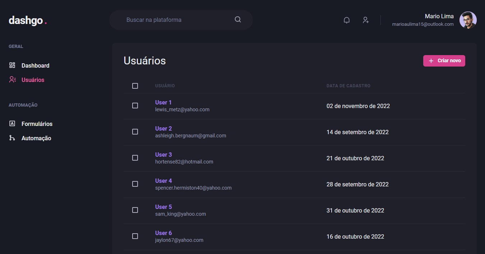
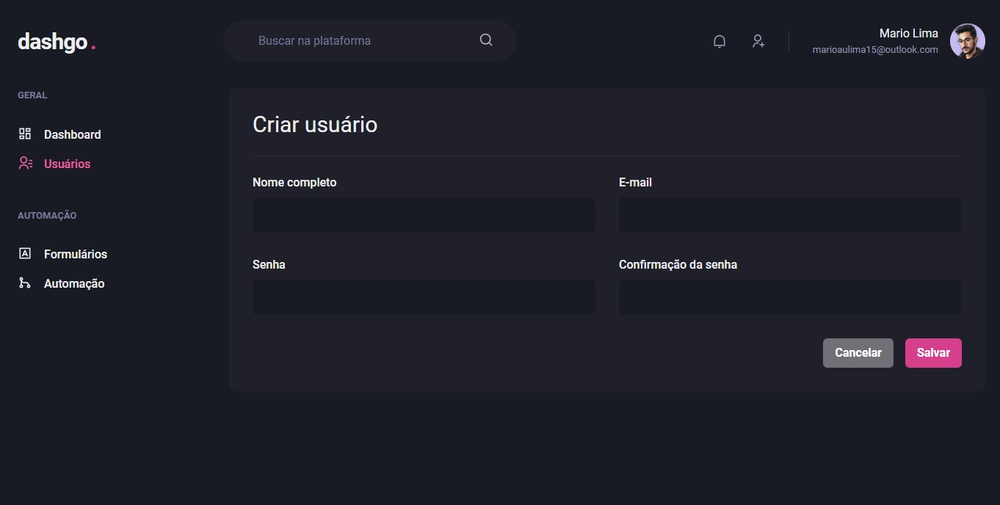

## 💻 Sobre o projeto

Um dashboard feito em TypeScript, React, Next, react-apexcharts, yup e Chakra-Ui.

<div align="center">
    
</div>

<div align="center">
    
</div>

<br>

## 🧪 Tecnologias usadas

Esse projeto foi desenvolvido com as seguintes tecnologias:

- [React](https://reactjs.org)
- [TypeScript](https://www.typescriptlang.org/)
- [Chakra-UI](https://sass-lang.com/](https://chakra-ui.com/))
- [Next.js](https://nextjs.org/)
- [React Hook Form](https://react-hook-form.com)
- [yup](https://github.com/jquense/yup)

## 🔗 Clone a aplicação

Clone o projeto e acesse a pasta do mesmo.

```bash
$ git clone https://github.com/limaCoder/ignite-dashgo-next-app
$ cd dashgo
```

## 🚀 Como iniciar a aplicação

Para iniciá-lo, siga os passos abaixo:

```bash
# Instalando dependências:
$ yarn
# Rodando em modo de desenvolvimento:
$ yarn dev
```

O app estará disponível no seu browser pelo endereço http://localhost:3000 assim que iniciado.

## 🌐 Live preview

Sem live preview no momento.
